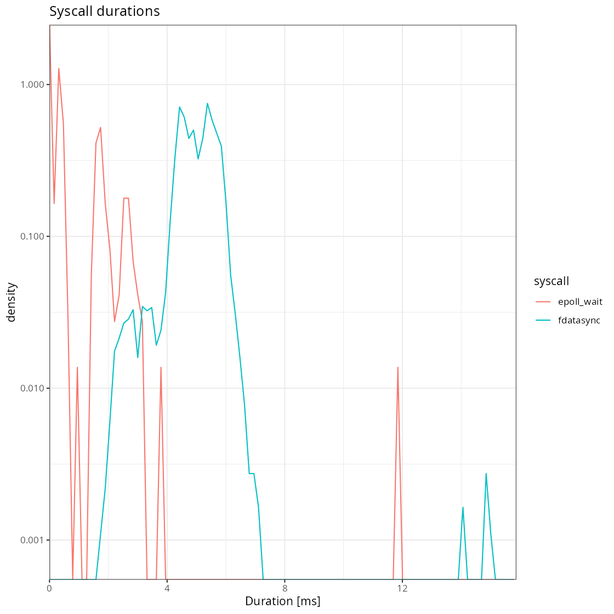
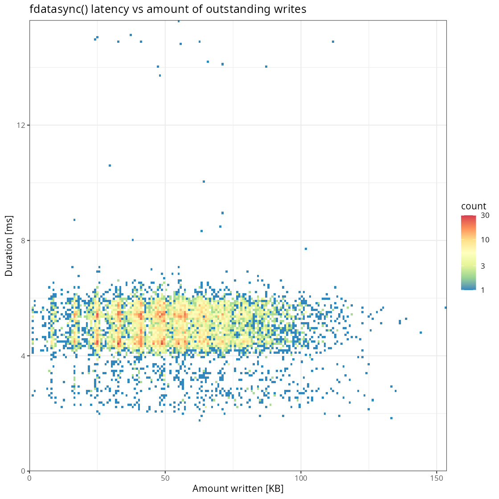
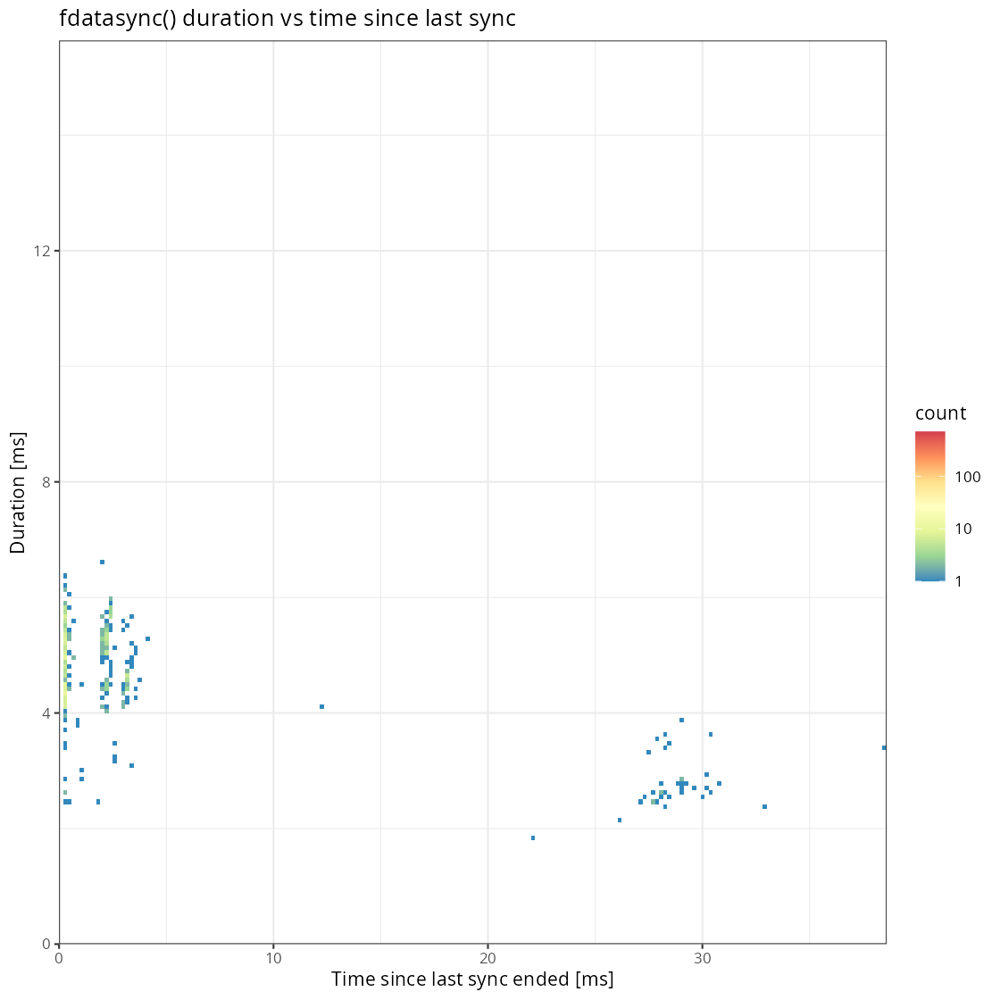
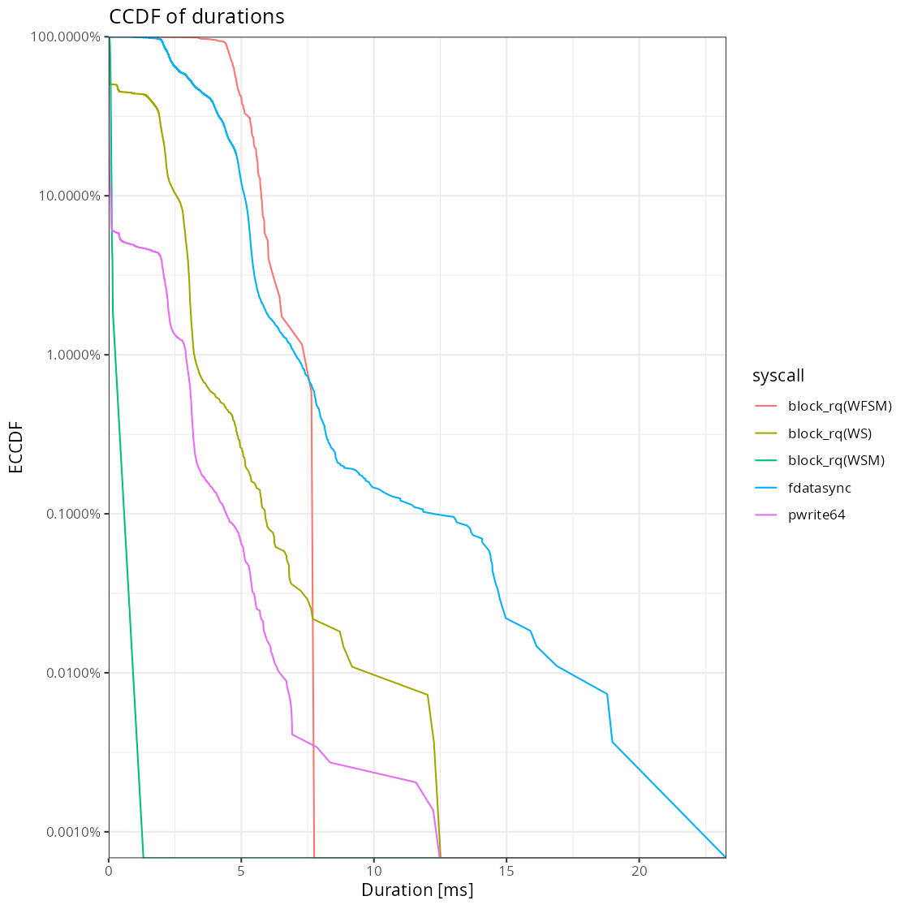
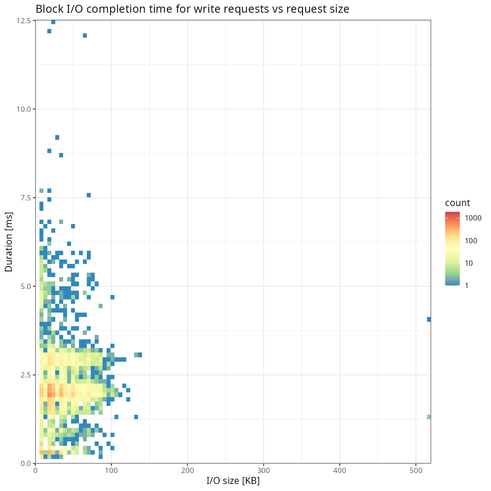

# perf-analysis

Some tools to analyse perf captures to analyse PostgreSQL behavior.

Examples of things this enables:

* strace like capture of all system calls.
* Find slowest syscalls from a trace.
* Latency histogram for each syscall type.
* How much data was written out by fdatasync.
* block device request completion time analysis.
* find call stacks for slow syscalls. 

Warning: perf can capture quite a lot of data, so you can't leave this running all the time.

## Usage

First you'll need to capture perf trace of the relevant events. For this the perf-tools package needs to be installed
for the currently running kernel. The following assumes root privileges.

Here for example we are capturing all syscalls from walreceiver process for a duration of 60 seconds,

```shell
perf record -p $walreceiver -e 'syscalls:sys_*' \
   -o syscalls-$walreceiver-$(date "+%Y.%m.%d-%H.%M.%S").perf \
   -- sleep 60
```

Another example for capturing all writes, fsyncs and block device queue, issue and completion events:

```shell
perf record -a -e 'block:block_rq_insert,block:block_rq_issue,block:block_rq_complete,syscalls:sys_*_fdatasync,syscalls:sys_*_pwrite64' \
   -o ioevents-$(date "+%Y.%m.%d-%H.%M.%S").perf \
  -- sleep 60
```

The output file then needs to be converted to text format using `perf script` before further processing. This
conversion needs to happen on the source server to have the necessary symbols available. As the files are big it's
recommended to compress them. Zstandard, lz4 and gzip decompression is supported transparently by the analysis tool.

Example for converting all .perf captures into compressed text format:

```shell
for perffile in *.perf
do
  scriptfile=${perffile/.perf/.script}.zst
  if [ ! -e $scriptfile ]; then 
    perf script -i "$perffile" | zstd -1 > "$scriptfile" 
  fi
done 
```

The analysis of text format output can then be done on any system by transferring the files.

## Analysis outputs

Default output is to pair up syscall enter/exit events, and block device issue/complete events and output the resultant
events. The columns are pid, time, duration, syscall = returncode.

Example output:

```
$ perf-analysis.py syscalls-*.script.zst | head
630406    959683.135522   0.006 kill = 0 
630406    959683.135534   0.007 sendto(fd=6) = 39 
630406    959683.135541   0.005 epoll_create1 = 8 
630406    959683.135546   0.003 epoll_ctl = 0 
630406    959683.135550   0.003 epoll_ctl = 0 
630406    959683.135554   0.003 epoll_ctl = 0 
630406    959683.135561   0.006 close(fd=8) = 0 
630406    959683.135566   0.003 sendto(fd=6) = 39 
630406    959683.135573   0.004 recvfrom(fd=6) = 622 
630406    959683.135587   0.011 pwrite64(fd=7) = 592
```

Syscalls can be excluded with `--ignore` or included with `--include`:

```
$ perf-analysis.py syscalls-*.script.zst --include=fdatasync,fsync | head -n3
630406    959683.139457   3.858 fdatasync(fd=7) = 0 
630406    959683.144179   4.583 fdatasync(fd=7) = 0 
630406    959683.149900   5.594 fdatasync(fd=7) = 0 
```

Top latency events can be selected with `--top`:

```
$ perf-analysis.py syscalls-*.script.zst --include=fdatasync,fsync --top=3
630406    959727.769955  25.410 fsync(fd=7) = 0 
630406    959711.608605  19.201 fsync(fd=7) = 0 
630406    959741.311612  16.546 fsync(fd=7) = 0
```

All events above some latency can be select with `--min-latency`:

```
$ perf-analysis.py syscalls-*.script.zst --min-latency=15
630406    959688.587790  15.021 fdatasync(fd=7) = 0 
630406    959688.646425  15.096 fdatasync(fd=7) = 0 
630406    959689.177252  16.229 fsync(fd=7) = 0 
630406    959692.434673  16.140 fsync(fd=7) = 0 
630406    959694.084199  16.497 fsync(fd=7) = 0 
630406    959695.140520  15.639 fdatasync(fd=7) = 0 
630406    959697.372019  15.745 fsync(fd=7) = 0 
630406    959700.632125  15.149 fsync(fd=7) = 0 
630406    959705.334123  15.511 fsync(fd=7) = 0 
630406    959711.608605  19.201 fsync(fd=7) = 0 
630406    959713.244461  15.723 fsync(fd=7) = 0 
630406    959727.769955  25.410 fsync(fd=7) = 0 
630406    959741.311612  16.546 fsync(fd=7) = 0 
```

Per syscall duration histogram can be calculated by adding `--stat`:

```
$ perf-analysis.py syscalls-*.script.zst --include=fdatasync,pwrite64,epoll_wait,fsync --stat --base=10
latency [ms] pwrite64 fdatasync epoll_wait fsync
       0.000                             1     3
       0.001    12213                  179    34
       0.010     9114                           
       0.100       19                  148      
       1.000        2     11529        132    74
      10.000                 16          1    37
```

Output of event lists can also be formatted as JSON or CSV:

```
$ perf-analysis.py syscalls-*.script.zst --include=fdatasync,fsync --top=3 --format=csv
filename,line,pid,time,duration,syscall,detail,returncode,fd
syscalls-630406-2025.01.07-14.22.07.script.zst,258984,630406,959727.769955,0.025410000002011657,fsync,,0,7
syscalls-630406-2025.01.07-14.22.07.script.zst,162906,630406,959711.608605,0.019200999988242984,fsync,,0,7
syscalls-630406-2025.01.07-14.22.07.script.zst,338912,630406,959741.311612,0.016546000028029084,fsync,,0,7
```

### Receive to send latency analysis

For understanding walreceiver feedback latency it can be useful to measure time from reception of a packet
to sending back a heartbeat after writing it to disk. This analysis makes some assumptions about contents of packets
that might not be 100% accurate but are usually good enough. Specifically, it considers any received packet to be WAL,
any write writing out all received WAL so far, and any send acknowledging this write.

The output of the analysis pass is an event for each send, with a duration set to the corresponding receive event.
Event detail field contains breakdown of which syscalls were active during this period.

It expects as input a capture of all syscalls from the walreceiver proces.

```
# perf-analysis.py syscalls-*.script.zst --recv-to-send --top=10
630406    959698.994158   6.355 recv-to-send = 0 fdatasync: 99.6%, pwrite64: 0.1%
630406    959684.677579   6.190 recv-to-send = 0 fdatasync: 99.4%, recvfrom: 0.2%, pwrite64: 0.2%
630406    959690.769567   5.973 recv-to-send = 0 fdatasync: 99.5%, recvfrom: 0.2%, pwrite64: 0.2%, none: 0.2%
630406    959703.754897   5.750 recv-to-send = 0 fdatasync: 99.5%, recvfrom: 0.3%, pwrite64: 0.2%
630406    959732.814511   5.676 recv-to-send = 0 fdatasync: 99.5%, pwrite64: 0.2%, recvfrom: 0.1%
630406    959686.302053   5.643 recv-to-send = 0 fdatasync: 99.5%, recvfrom: 0.4%, pwrite64: 0.1%
630406    959739.467002   5.607 recv-to-send = 0 fdatasync: 99.2%, recvfrom: 0.2%, pwrite64: 0.2%, none: 0.2%, kill: 0.2%
630406    959724.438814   5.598 recv-to-send = 0 fdatasync: 99.5%, recvfrom: 0.2%, pwrite64: 0.2%
630406    959729.480568   5.545 recv-to-send = 0 fdatasync: 99.4%, recvfrom: 0.2%, pwrite64: 0.2%, kill: 0.1%, none: 0.1%
630406    959702.184103   5.542 recv-to-send = 0 fdatasync: 99.5%, recvfrom: 0.2%, pwrite64: 0.1%, none: 0.1%
```

### Amount fdatasynced

This analysis adds up pwrite64's for a given fd and the outputs all fdatasync events on this fd annotated with the amount
written out in the detail field.

### Datasync delta analysis

This analysis calculates time delta between consecutive fdatasync calls. The timedelta is stored in the detail field.

```
$ perf-analysis.py syscalls-*.script.zst --delta-datasync | head -n4
630406    959683.144179   4.583 fdatasync(fd=7) = 0 0.000139000010676682
630406    959683.149900   5.594 fdatasync(fd=7) = 0 0.00012699991930276155
630406    959683.153044   2.967 fdatasync(fd=7) = 0 0.0001770000671967864
630406    959683.163714  10.606 fdatasync(fd=7) = 0 6.400002166628838e-05
```

## Included plots

If R with ggplot2 is available then the data can be visualized using some provided R scripts.

Usage:

```
perf-analysis.py path-to/*.script.zst ... --format=csv > path-to/output.csv
plots/name-of-plot.R path-to/output.csv path-to/output.png
```

See the Makefile in demodata/ folder for more details.

### syscall-histogram.R

Normalized histogram of all different syscalls to get an overview. 



### fdatasync-latency.R 

Heatmap of latency of fdatasync over the amount of outstanding writes to see if it is size related.



### fdatasync-delta.R

Heatmap of time since last fsync ended vs duration of fsync. 



### duration-ccdf.R

Logarithmic scale plot of percentage of events that are higher than a duration. Useful for understanding frequency
of tail latencies.



### block-latency-size.R

How is write latency at the block device layer affected by I/O size: 



## Tips

After finding outlier events it is often useful to go back to the original .script file to see what was the general
behavior during this event.
